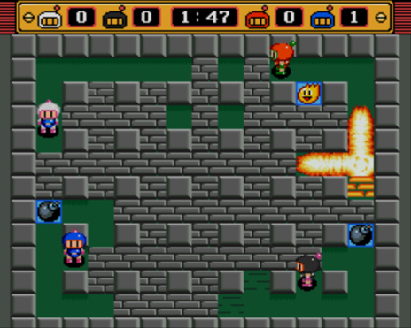

	 	 	
# Trabajo Práctico del Taller de Programación Avanzada

## Introducción
Durante el taller desarrollaremos un juego: el clásico Bomberman ([Ejemplo](https://play.google.com/store/apps/details?id=com.hyperkani.bomberfriends)).

En las clases del taller se les proveerá de herramientas para poder realizarlo en Java, con las buenas prácticas que irán adquiriendo.

### Metodología de trabajo
La realización del juego, tendrá cuatro etapas con sus respectivas entregas:

| Fecha | Contenido de la entrega                                               |
|-------|----------------------------------------------------------------------------------------------------------------|
| 04/05 | Diagrama de clases del modelo del juego, implementado y testeado                                               |
| 01/06 | Posibilidad de interactuar con los elementos del juego en tiempo real en un entorno simulado, de forma gráfica |
| 22/06 | Capacidad de ser jugado a través de cliente-servidor                                                           |
| 13/07 | Requisitos extra acordados                                                                                     |

> Se espera que las prácticas de programación sean buenas, y adecuadas al conocimiento adquirido en la materia.
> Esto incluye evitar el código aglomerado, tener una buena interacción de clases, no tener código duplicado, tener el código indentado y prolijo, entre otras.

---

## Mecánica del juego

La mecánica del juego es similar a la del clásico bomberman, pero con arquitectura cliente-servidor.
* Una partida debe contar como mínimo con 2 bomberman (y soportar al menos 4)
* Una partida debe contar con múltiples rondas
* La partida finaliza cuando un bomberman haya llegado a un puntaje objetivo
* El final de la ronda debe estar determinado por supervivencia y por un límite de tiempo
* Al final de la ronda habrá como máximo un ganador, que recibirá 1 punto
* El mapa se compone de un terreno de múltiples pasillos (entorno)
* El mapa contiene obstáculos en un porcentaje de su zona libre personalizado
* La posición de los obstáculos es determinada al azar
* Los bomberman solo se pueden desplazar hacia terreno libre, o atravesando a otro bomberman
* El movimiento de los bomberman será de forma horizontal o vertical, pero no a través de saltos de casillero. El movimiento se tiene que sentir fluido
* La posición inicial de los bomberman puede ser estática o dinámica, pero el promedio de distancia de un bomberman hacia todos los demás debe ser el aproximadamente el mismo para todos los bomberman
* Los bomberman pueden dejar una bomba, que solo se puede colocar en el centro de un casillero (Esto se puede hacer desplazando la bomba hacia al mismo, sólo permitiendo colocar bombas al estar encima de esa posición; o una mezcla de ambas)
* Los bomberman cuentan con una cantidad limitada de bombas colocadas al mismo tiempo
* Las bombas explotan después de unos instantes, o cuando son impactadas con otra explosión, eliminando a cualquier bomberman y obstáculo en su rango de efecto
* El rango de efecto de las bombas se ve interrumpido o limitado por el entorno, los obstáculos y los bomberman
* El rango de efecto debe ser como mínimo de 1 casillero, (el propio lugar, y uno más)

## Requisitos esenciales

1. Como usuario quiero ingresar al juego con mi nombre de usuario y contraseña, para poder jugar contra otros jugadores en una sala
2. Como usuario quiero seleccionar una sala de las existentes, para poder ingresar y jugar con los participantes (*1)
3. Como usuario quiero crear nuevas salas para que ingresen otros jugadores (*2)
4. Como usuario quiero poder salir de una sala, incluso si en la misma el juego se encuentra corriendo
5. Como usuario quiero poder identificar cada bomberman (saber quién lo maneja, y ver su puntaje)

Notas:
> (*1) Una sala puede estar activa para que ingresen jugadores mientras un juego no esté activo en la misma. Aún así, debe aparecer en la lista de juegos como que el juego ya inició

> (*2) La partida podrá ser iniciada por el creador de la sala, o cuando todos los jugadores estén listos, o cualquier otra condición que consideren

## Requisitos opcionales

Los obstaculos, al ser destruidos, dejan power ups

1. Como usuario quiero crear salas privadas, en las cuales solo pueden ingresar los usuarios que deseo *(esto se puede hacer, por ejemplo, a través de contraseñas, o salas que sólo se pueda ingresar con invitación)*
2. Como usuario quiero poder utilizar un joystick (todo lo necesario para que funcione debe estar en código propio java [no mapear joystick a teclas por ejemplo])
3. Como usuario quiero poder jugar una partida de un solo jugar contra la AI, sin necesidad de ingresar usuario, ni crear salas
4. Como usuario quiero enviar reacciones o mensajes predeterminados durante la partida
5. Como usuario quiero elegir al momento de crear la sala un terreno donde ocurrirá el juego (tamaño, estilo, cantidad de obstáculos, etc)
6. Como usuario quiero configurar los controles de mi personaje
7. Como usuario quiero ver mi historial de partidas con sus detalles *(puntos, cantidad de obstáculos eliminados, asesinatos, muertes, etc; de cada bomberman)*
8. Como usuario quiero ingresar a una partida, pero no participar, sino solo ver la partida, como un espectador, pudiendo ingresar y salir de la misma en cualquier momento
9. Como usuario quiero obtener ventajas temporales sobre los otros jugadores, que se conseguirán al destruir obstáculos (aumentar la cantidad máxima de bombas a colocar a la vez, velocidad de desplazamiento, invulnerabilidad temporal, aumento del área de efecto de las bombas, vida extra, etc)
10. Como usuario quiero disfrutar de buenos efectos de sonido y música mientras juego

> Aceptamos sugerencias de requisitos opcionales

**Continuará...**
